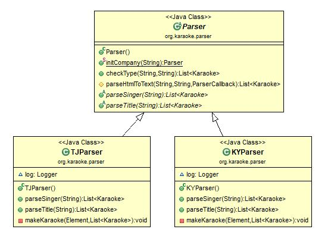

### 개요     

코인노래방이 증가하면서, 부르고 싶은 노래를 저장하고 싶은 때가 있습니다.       
그래서 아는 분이 구현한 프로젝트가 이겁니다...     

[노래노트](http://www.noraenote.com/)     

해당 프로젝트는 노래노트에 사용되는 API를 구현한 것으로, 노래방 번호 및 곡 제목 등의 Text 정보를 가져올 수 있습니다.    

#### 노래방 번호 파싱     

태진(TJ)노래방과 금영노래방(KY)의 노래 번호를 파싱하는 프로젝트.      

api 형태로 제작 중이며, 다음과 같이 사용할 수 있습니다.    

	/TJ/singer/가수명  
	/TJ/song/제목     

> 예시   

	{"number":"62349","title":"봄이좋냐??","singer":"10cm","lyricist":"권정열,윤철종","composer":"권정열,윤철종"}   

    
#### 구현       

> Service 부분     

	public List<Karaoke> makeKaraokeNumber(String company, String type, String title) {
		// invalidate
		if (company == null || type == null || title == null 
				|| "".equals(company) || "".equals(type) || "".equals(title)) {
			return null;
		}
		List<Karaoke> list = null;
		Parser ms = Parser.initCompany(company);
		try {
			list = ms.checkType(type, title);
		} catch (IOException e) {
			// TODO Auto-generated catch block
			e.printStackTrace();
			log.fatal("url connect error !");
		}
		return list;
	}   

controller에서 RESTful한 방식으로 url을 설계했습니다.       

> /{company}/{category}/{title}       
 
company 와 category(String)를 받아, Factory Pattern으로 객체를 생성했습니다.    
    
	// 객체 생성
	Parser ms = Parser.initCompany(company);

	public static Parser initCompany(String info) {
		// 회사 추출
		if ("TJ".equals(company)) {
			return new TJParser();
		} else if ("KY".equals(company)) {
			return new KYParser();
		}
		return null;
	} 

	// 검색 
	list = ms.checkType(category, title);     

	public List<Karaoke> checkType(String category, String name) throws IOException {
		if (category.equals("song")) {
			return this.parseTitle(name);
		} else if (category.equals("singer")) {
			return this.parseSinger(name);
		} else {
			return null;
		}
	}      

> Template Pattern을 공부하면서 작성했던 부분 입니다.  
> 구현은 하위 클래스에게 맡기고, abstruct class 에선 메서드 선언만 해두었습니다.     

parseTitle 과 parseSinger의 공통된 부분을 분리하는 과정에서, parseHtmlToText 함수를 생성했습니다.   

	protected List<Karaoke> parseHtmlToText(String url,String selector ,ParserCallback callback){
		List<Karaoke> list = new ArrayList<Karaoke>();
		try {
			Document doc = Jsoup.connect(url).get();
			Elements tds = doc.select(selector);
			try {
				for (Element e : tds) {
					callback.HtmlToTextCallback(e, list);
				}
			} catch (IndexOutOfBoundsException exception) {
				return null;
			}
		}catch(IOException exception) {
			// 재호출
			this.parseHtmlToText(url, selector, callback);
		}
	
		return list;
	}
해당 함수는 url과 selector, ParserCallback 받고, 내부 구현은 ParserCallback의 함수를 사용합니다. jdbc template의 callback 함수를 보고 영감(?)을 받아 위와같이 구현했습니다.         

	public interface ParserCallback {
		void HtmlToTextCallback(Element e, List<Karaoke> list);
	}

해당 interface는 함수형 인터페이스입니다.   
 
> 메서드를 하나 갖고있습니다.     

호출부는 다음과 같습니다.     

	parseHtmlToText(text, ".tbl_board tbody tr:has(td)", (Element e, List<Karaoke> list) -> {
				makeKaraoke(e, list);     

익명 Class 보다 조금더 깔끔한것 같아, 람다를 사용했습니다.     

> Parser Class들 간의 ClassDiagram  

          

#### 패치노트   

> ~ 2016.12       
      
TJ 노래방 파싱 완료 
	 
> 2017.08.13     

기존 프로젝트 소스 정리      

> 2017.08.15 
     
KY 기능 구현.    
service 계층 추가.      
소스 수정 및 프로토타입(home.jsp) 구현.     

> 2017 .08.16

TJ Cache 구현 완료       
KY 구현 후, 관련부분 리펙토링 예정.        

> 2017 .08.17   

KY 캐싱 구현.      

> 2017 08.22       

전략패턴 부분의 new 키워드 삭제.    

    
	그 과정에서 추상클래스 였던 Parser를 일반클래스로 돌리고
	abstract method들의 반환값을 null로 설정.     

	// abstract일 경우 bean으로 등록이 안되는 문제가 발생... 
	public List<Karaoke> parseSinger(String key) throws IOException {
		return null;
	}

	public List<Karaoke> parseTitle(String key) throws IOException {
		return null;
	}

해당 부분들은 자식 Class에서 Override를 하여 사용.      

Cache 부분을 구조화하고, 객체를 Spring이 관리하게끔 수정      

+ 추가해야 할 부분  
    
      
 1. 캐싱 (진행중) - Scheduler을 통한 데이터 관리 진행해야함.
 2. Java doc 진행 
 3. Scheduling 진행 
